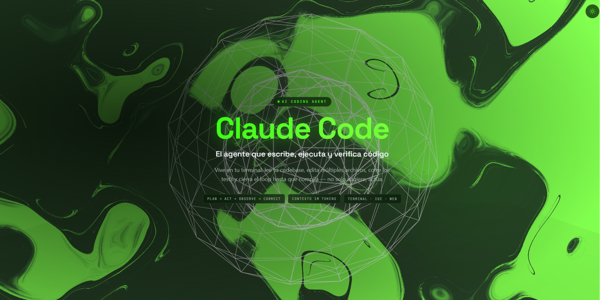

# Claude Dev 3D SPA — Vibecoding Workshop

> Immersive 3D single-page app about **Claude Code**, built almost entirely **by Claude Code** through doc-driven, skill-loaded, agent-orchestrated **vibecoding**.
>
> React 19 · React Three Fiber · Tailwind v4 · GSAP · Lenis

🌐 **[Español](./README.es.md)** · **English** &nbsp;·&nbsp; 🚀 **[Live demo →](https://workshop-claude-sigma.vercel.app)**

[](https://workshop-claude-sigma.vercel.app)

---

## What this is

This repository is a **hands-on workshop**: a reproducible experiment in building a real, immersive product with Claude Code as the developer — not as an autocomplete, but as an agent that plans, edits many files, runs the build, and closes the loop until it compiles.

**🔗 Live:** https://workshop-claude-sigma.vercel.app — deployed free on Vercel.

The end result is the SPA in the screenshot above: a wireframe icosahedron floating in a "toxic-green" liquid shader, with seven content sections that scroll around a 3D model controlled by scroll progress, a light/dark theme, and DOM entrance animations.

**Authorship:** the workshop itself — the concept, the prompts, the docs, the content, and the architecture decisions — was authored **by me** ([@juliannichollsc](https://github.com/juliannichollsc)). The **agents and skills** that Claude Code loads along the way are **third-party**. The point of the experiment is to see how far *vibecoding with Claude* can go when you drive it with good documentation and let it orchestrate specialized subagents.

---

## Build it yourself — two prompts, two sessions

The workshop is designed to be run in **two steps**, each in a fresh Claude Code session. Everything Claude needs lives in `docs/`.

### Step 1 — `docs/PROMPT-1-PROYECTO-BASE.md`

Builds the **scaffold** and **one working view: the hero**.

- Vite + React 19 + TypeScript + Tailwind v4
- All dependencies installed with **pnpm** (mandatory) and peer versions pinned for React 19
- Folder structure, TypeScript types, and `canvas/` placeholders that only need to compile
- The hero section, fully implemented

Success criterion: the hero renders and the project builds. This proves the stack is wired correctly *before* taking on the risk of the 3D layer.

### Step 2 — `docs/PROMPT-2-CONSTRUIR-SPA.md`

Takes what step 1 left and builds **everything else** in a clean session:

- Two subagents (`technical-agent`, `qa-agent`, both on `sonnet`)
- Third-party skills installed and locked in `skills-lock.json`
- The animated 3D scene (procedural icosahedron, bloom, scroll-driven rotation)
- Light/dark theme
- The seven content sections about Claude Code

The main Claude session **orchestrates directly**: it decomposes the task, delegates the technical work to `technical-agent`, has `qa-agent` verify, and does all the visual work itself. There is no orchestrator agent and no `ui-agent` — see [`CLAUDE.md`](./CLAUDE.md) for the rationale.

---

## Presentation & reference material (`docs/`)

| File | What it is |
|---|---|
| `docs/presentacion-workshop.html` | The **workshop presentation** — open it in a browser |
| `docs/CONTENIDO-CLAUDE.md` | Source of truth for the SPA **text** about Claude Code, plus data mistakes already caught |
| `docs/ANIMACION-3D.md` | The 3D scene and the three architecture traps (shader inside the Canvas, measured `pages`, never ScrollTrigger) |
| `docs/testing-background.md` | The background shader and its presets |
| `docs/PROMPT-1-*` / `docs/PROMPT-2-*` | The two build prompts described above |

---

## Stack

- **React 19** + **TypeScript** + **Vite**
- **@react-three/fiber** + **@react-three/drei** for 3D
- **@react-three/postprocessing** for Bloom
- **Tailwind CSS v4**
- **GSAP** + **@gsap/react** for DOM entrance animations (fired by `IntersectionObserver`, never ScrollTrigger)
- **Lenis** for smooth scroll

### Architecture in one breath

The `<Canvas>` is fixed full-viewport at `z-index: 0`. HTML sections render inside drei's `<Scroll html>`. A procedural wireframe icosahedron stays centered and rotates on its X axis as you scroll, while the content scrolls around it. Content is typed and imported from `src/data/cv.ts` — zero hardcoded text in components.

---

## Run locally

**pnpm is mandatory** — never npm or yarn.

```bash
pnpm install
pnpm dev      # http://localhost:5173
pnpm build    # tsc -b && vite build
pnpm preview
```

---

## License & credits

Workshop concept, prompts, docs, and content by [@juliannichollsc](https://github.com/juliannichollsc). Built as an experiment in vibecoding with **Claude Code**. The agents and skills loaded during the build are third-party tooling and belong to their respective authors.
